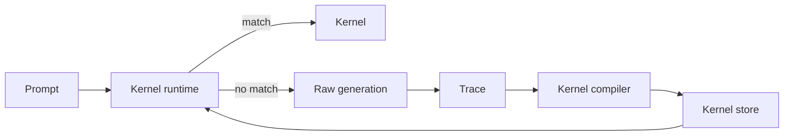

# KernelWeave Master Documentation

Welcome to the comprehensive guide for KernelWeave. This document combines all spread-out documentation into a single, cohesive reference.

---

## 1. Vision & Overview

KernelWeave aims to be the **Neuro-Symbolic Operating System** for language models. The core idea is to shift from unstructured, token-by-token generation to **verifiable reasoning patterns** stored as "kernels".

When a language model solves a task successfully, KernelWeave:
- Stores the reasoning pattern as a typed kernel.
- Verifies future outputs against postconditions before caching.
- Routes similar prompts to cached kernels.
- Accumulates verified competence over time.

### Architecture

KernelWeave has four main layers:

1.  **Trace capture** — stores solved behaviors as structured events.
2.  **Kernel compilation** — distills a trace into a reusable, typed kernel.
3.  **Kernel runtime** — selects kernels for future prompts.
4.  **Regression gate** — rejects kernels that fail evidence or output tests.

---

## 2. Critical Clarification: The "LLM" Module

The `kernelweave.llm` module is a **routing and simulation layer**, not a neural network.

-   There are **NO model weights** in this repository's core.
-   There is **NO PyTorch, JAX, or tensor framework** required for the core logic (check `pyproject.toml`, it has zero dependencies).
-   The `KernelWeaveLLM` class routes prompts to skill kernels stored as JSON; it does NOT run inference.
-   The "LLM" naming is legacy — the module is fundamentally a routing layer.

*The intelligence comes from the structure and verification, not from massive parameter counts.*

---

## 3. Quick Start & Fast Path

### Files to Know
-   `KernelWeave_LLM_Product_Train.py` — Full training + benchmark + realtime demo runner (uses external ML libraries to train the router).
-   `standalone_train.py` — A standalone version of the training script.

### Fast Path to Demo
1.  Run the training script (e.g., on Kaggle or a local GPU machine) to train the router adapter.
2.  Open the generated artifacts:
    -   `kernelweave_llm_bundle/benchmark/benchmark.md`
    -   `kernelweave_llm_bundle/realtime_demo.md`
3.  Share the results using the export zip in `kernelweave_llm_export/`.

---

## 4. What Works Now vs. Future Vision

### What Works Now
-   **Semantic routing** — Embedding-based similarity + calibration scoring.
-   **Postcondition verification** — Checks outputs against kernel constraints (currently prototype-level with retries).
-   **Feedback accumulation** — Records success/failure for each kernel.
-   **Auto-promotion** — High-confidence repeated successes become candidate kernels.
-   **Smart Compilation** — The compiler can use an LLM to extract real preconditions and postconditions from traces (Newly implemented!).

### The Revolutionary Pillars (In Progress)
1.  **True Constrained Decoding**: Moving from regex and retries to token-level logit masking to guarantee outputs match the schema.
2.  **Kernel Composition Algebra**: Developing operations (like sequence and parallel) to combine kernels dynamically.
3.  **Self-Compilation**: Enhancing the compiler to automatically extract general patterns from successful traces.

---

## 5. Directory Guide (Decluttered)

-   `kernelweave/` — Core source code.
    -   `compiler.py` — Trace to kernel compiler.
    -   `runtime.py` — Execution and routing.
    -   `constrained.py` — Structured decoding (Prototype).
    -   `compose/` — Kernel composition logic.
-   `store/` — JSON store for kernels and traces.
-   `tests/` — Regression suite.
-   `phasecd/` — Dataset specs and benchmark harness.
