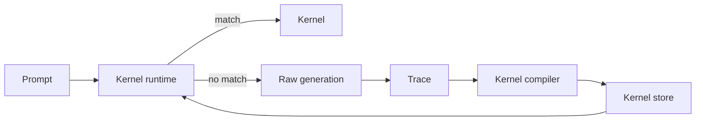

# Architecture

KernelWeave has four layers:

1. **Trace capture** — store solved behaviours as structured events.
2. **Kernel compilation** — distil a trace into a reusable, typed kernel.
3. **Kernel runtime** — select kernels for future prompts.
4. **Regression gate** — reject kernels that fail evidence or output tests.

The key idea is that competence becomes executable, not merely remembered.

